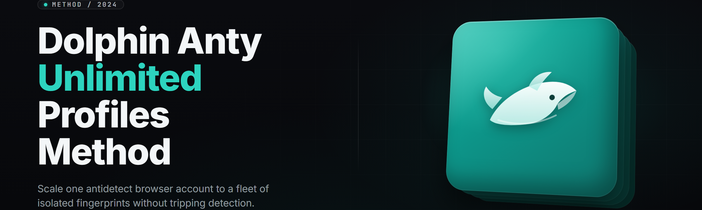

  
  
  

  

  
  

---

**The standalone Windows `.exe` that unlocks unlimited Dolphin Anty browser profiles — one click, no fingerprint collisions, no account-level caps.**

A portable profile manager for the Dolphin Anty anti-detect browser. Extract the folder, run the `.exe`, and every profile slot you were told was locked opens up. Built for affiliates, media buyers, and multi-account operators who need real profile isolation without paying per-profile pricing tiers.

---

## 📖 Table of Contents

- [Overview](#-overview)
- [What is the Dolphin Anty Unlimited Profiles Method](#-what-is-the-dolphin-anty-unlimited-profiles-method)
- [The Problem](#-the-problem)
- [The Solution](#-the-solution)
- [Quick Start — Run the Tool](#-quick-start--run-the-tool)
- [Comparison](#-comparison)
- [Apply Modules — Grouped Catalog](#-apply-modules--grouped-catalog)
  - [🎭 Profile Spawning & Isolation](#-profile-spawning--isolation)
  - [🧬 Fingerprint Engineering](#-fingerprint-engineering)
  - [🌐 Proxy & Network Layer](#-proxy--network-layer)
  - [🤖 Automation & Team Sharing](#-automation--team-sharing)
  - [🛠️ Maintenance & Recovery](#️-maintenance--recovery)
- [System Requirements](#-system-requirements)
- [Installation](#-installation)
- [Known Issues](#-known-issues)
- [FAQ](#-faq)

---

## 🐬 Overview

| Category | Details |
|---|---|
| **Product name** | Dolphin Anty Unlimited Profiles Method |
| **Current build** | v2.7.3 (portable) |
| **Package** | Single `.exe` + config folder |
| **Install path** | Extract anywhere, no installer |
| **Target browser** | Dolphin Anty (Windows build) |
| **Runtime** | No Python, no Node, no `.git clone` |
| **Supports** | Local profiles, team folders, cloud sync mirrors |
| **Update model** | In-app version check, manual re-extract |

The Dolphin Anty Unlimited Profiles Method removes the profile ceiling that Dolphin Anty places on standard subscription tiers. Instead of renting profile slots, the tool manages your own local profile store, hooks into the browser's launcher, and presents every profile as a first-class entry — with its own fingerprint, proxy binding, cookie jar, and team assignment. The `.exe` is a launcher and profile orchestrator, nothing more. It does not modify Dolphin Anty's core binaries; it manages the profile ecosystem around them.

---

## 🧭 What is the Dolphin Anty Unlimited Profiles Method

| Term | Explanation |
|---|---|
| **Profile slot** | A single isolated browser identity — cookies, storage, fingerprint, proxy, all bound together. |
| **Unlimited method** | The pattern of running profiles from a local store instead of Dolphin Anty's metered cloud tier. |
| **Fingerprint** | The bundle of canvas, WebGL, audio, fonts, and hardware signals a site reads to identify you. |
| **Profile spawner** | The module that instantiates a new profile with a fresh, collision-free fingerprint seed. |
| **Proxy binding** | Attaching one proxy (or proxy rotation pool) to one profile for its entire lifetime. |
| **Team folder** | A shared profile group that multiple operators can open without stepping on each other. |
| **Cookie vault** | The encrypted local store that backs up and restores profile session state. |

Core benefits of the method:

- **No per-profile pricing** — profiles live on your disk, not on a metered plan.
- **No fingerprint collisions** — every spawned profile gets a unique seed derived from hardware + entropy pool.
- **Full proxy control** — bind, rotate, test, and fail over per profile.
- **Team-ready** — share profile folders over LAN or cloud folders without profile corruption.
- **Portable** — the whole thing runs from a USB drive if you want it to.

---

## 🩹 The Problem

Running many Dolphin Anty profiles on a normal setup breaks in predictable ways:

- **Profile caps.** Hit the tier limit and the browser refuses to launch the next one — right when a campaign needs it.
- **Fingerprint bleed.** Spawned profiles share canvas/WebGL seeds and get flagged as the same machine.
- **Proxy leaks.** One proxy mis-binds and every profile behind it is burned in a single session.
- **Team collisions.** Two operators open the same profile folder and the cookie jar corrupts.
- **No backup path.** A wiped profile store means every logged-in session is gone.
- **Manual spawn grind.** Creating 50 profiles by hand is a half-day of clicking.
- **Version drift.** A browser update silently changes the launcher contract and profiles stop opening.

---

## 🔧 The Solution

| Problem | Solution |
|---|---|
| Profile caps | Local profile store — the method runs profiles off disk, not a metered tier. |
| Fingerprint bleed | Fingerprint Forge seeds a unique canvas/WebGL/audio bundle per profile. |
| Proxy leaks | Proxy Guard binds one proxy per profile with live leak testing and failover. |
| Team collisions | Team Locker locks a profile to one operator session at a time. |
| No backup path | Cookie Vault snapshots every profile's state to an encrypted local archive. |
| Manual spawn grind | Bulk Spawner creates N profiles from a template in one batch. |
| Version drift | Launcher Bridge auto-detects the Dolphin Anty build and remaps the launch contract. |

---

  

---

## 🚀 Quick Start — Run the Tool

1. 🐬 **Get the package.** Grab the latest build from the project landing page and save the archive.
2. 📦 **Extract it.** Right-click → *Extract All* into any folder you control (avoid `Program Files`; use a plain user folder or a USB drive).
3. ▶️ **Run the `.exe`.** Double-click the executable. On first launch, point it at your Dolphin Anty install directory when prompted.
4. 🎭 **Spawn your first profile.** Use *Bulk Spawner* → set count → *Forge Fingerprint* → *Launch*.
5. 🌐 **Bind a proxy.** Open *Proxy Guard*, paste your proxy string, run the leak test, then lock it to the profile.

No command line. No dependency install. The `.exe` carries everything it needs.

---

## 🆚 Comparison

| Aspect | Typical Alternatives | Dolphin Anty Unlimited Profiles Method |
|---|---|---|
| Profile ceiling | Tier-based caps | Local store, no ceiling |
| Fingerprint seeding | Shared seed pool | Per-profile entropy + hardware seed |
| Proxy handling | Manual paste per launch | Bind-once, leak-tested, failover |
| Team sharing | Copy the whole folder | Locked team folders, no corruption |
| Backup | None | Encrypted cookie vault snapshots |
| Spawn speed | One at a time | Batch templates, N at once |
| Launch contract | Breaks on update | Launcher Bridge auto-remaps |
| Install | Installer + admin | Portable `.exe`, no admin needed |

---

## 📦 Apply Modules — Grouped Catalog

36 modules across five domains. Each category lists what you unlock.

### 🎭 Profile Spawning & Isolation

| Feature | Effect |
|---|---|
| Bulk Spawner | Creates 1–500 profiles from a single template in one batch. |
| Template Keeper | Saves fingerprint + proxy + extension sets as reusable presets. |
| Naming Engine | Auto-names profiles by campaign, date, geo, or custom pattern. |
| Isolation Enforcer | Guarantees no shared storage/cookie path between profiles. |
| Cold-Start Booster | Pre-warms profile cache so first launch isn't slow. |
| Cloner | Duplicates an existing profile's full config, minus cookies. |
| Geo-Spawn Router | Assigns profile region tags and maps them to proxy pools. |

### 🧬 Fingerprint Engineering

| Feature | Effect |
|---|---|
| Fingerprint Forge | Generates canvas, WebGL, audio, and font seeds per profile. |
| Hardware Spoofer | Emulates realistic CPU, RAM, GPU, and screen per profile. |
| Timezone Sync | Aligns profile timezone to its bound proxy's geo. |
| Language Weaver | Sets `Accept-Language` and navigator.language consistently. |
| WebRTC Guard | Blocks or spoofs WebRTC IP leaks per profile. |
| UA Rotator | Picks a coherent user-agent matching platform + version. |
| Collision Scanner | Flags any two profiles sharing a fingerprint seed. |
| Seed Vault | Stores and reuses proven fingerprint seeds on demand. |

### 🌐 Proxy & Network Layer

| Feature | Effect |
|---|---|
| Proxy Guard | Binds one proxy per profile for its full lifetime. |
| Leak Tester | Runs DNS/WebRTC/IP checks before a profile goes live. |
| Rotation Pool | Attaches a rotating proxy list to a profile group. |
| Failover Switch | Auto-swaps to a backup proxy on timeout. |
| Latency Map | Ranks proxies by measured latency and success rate. |
| Sticky Session | Keeps one exit IP across a session for login flows. |
| Protocol Mixer | Supports HTTP, HTTPS, SOCKS4, SOCKS5 in one pool. |

### 🤖 Automation & Team Sharing

| Feature | Effect |
|---|---|
| Team Locker | Locks a profile to one operator at a time. |
| Folder Sync | Mirrors team profile folders over LAN or cloud storage. |
| Launcher Bridge | Auto-detects the Dolphin Anty build and remaps the launch contract. |
| API Hook | Exposes a local REST endpoint for spawn/launch/close. |
| Scheduler | Opens and closes profiles on a cron-like timetable. |
| Extension Loader | Injects per-profile extension sets from a shared library. |
| Activity Log | Records who opened which profile and when. |

### 🛠️ Maintenance & Recovery

| Feature | Effect |
|---|---|
| Cookie Vault | Encrypted local snapshots of every profile's session state. |
| Restore Point | Rolls a profile back to a known-good snapshot. |
| Store Doctor | Repairs corrupted profile folders and orphaned locks. |
| Config Migrator | Moves profiles between machines without re-login. |
| Update Watcher | Alerts when the Dolphin Anty build changes. |
| Cleanup Sweeper | Purges dead profiles and stale proxy bindings. |
| Export Packer | Bundles a profile set into a portable archive. |

> **Note:** every module writes to the local profile store only. Nothing leaves your machine unless you configure Folder Sync.

---

## 🔩 System Requirements

| Component | Minimum | Recommended |
|---|---|---|
| OS | Windows 10 (64-bit) | Windows 11 (64-bit) |
| CPU | 4 cores | 8+ cores |
| RAM | 8 GB | 16 GB+ |
| Disk | 2 GB free | 20 GB+ SSD for large stores |
| Browser | Dolphin Anty (current) | Latest Dolphin Anty build |
| Network | Any stable connection | Low-latency proxy pool |
| GPU | Integrated | Dedicated (for WebGL fingerprint fidelity) |
| Privileges | Standard user | Standard user |

Optional RAM/disk sizing guide per profile count:

| Profiles | Est. RAM in use | Est. disk |
|---|---|---|
| 10 | ~1.5 GB | ~4 GB |
| 50 | ~6 GB | ~18 GB |
| 200 | ~22 GB | ~70 GB |

---

## 🛠️ Installation

1. **Download and extract.** Pull the archive from the landing page, extract it into a folder you control. Keep the `.exe` and its `config/` folder together.
2. **First-run config.** Launch the `.exe`, and when it asks for your Dolphin Anty install path, browse to it. The Launcher Bridge validates the build version and saves the mapping.
3. **Spawn and lock.** Create your first profile, forge a fingerprint, bind a proxy, and run the leak test. Once it passes, lock the profile and launch.

> **Tip:** run the `.exe` from a folder excluded from real-time AV scanning for faster bulk spawns.

---

## 🐞 Known Issues

| Issue | Solution |
|---|---|
| Profiles won't launch after a browser update | Open *Launcher Bridge* → *Re-detect build*. |
| Fingerprint Collision warning on import | Run *Collision Scanner* and re-forge the flagged profile. |
| Proxy leak test fails on a fresh profile | Confirm the proxy format (`user:pass@host:port`) and retry. |
| Team folder shows "locked by another user" | Stale lock — run *Store Doctor* → *Clear Locks*. |
| Slow bulk spawn on HDD | Move the profile store to an SSD, or lower batch size. |
| Cookie Vault restore misses recent session | Snapshot before closing; autosave runs every 10 min. |

---

## ❓ FAQ

Does this bypass Dolphin Anty's paid tiers?

The method runs profiles from your own local store rather than a metered cloud tier. It doesn't crack the browser — it manages the profile ecosystem around it.

Will my profiles get detected?

Detection depends on fingerprint quality and proxy hygiene, not the tool itself. Per-profile fingerprint seeding and proxy binding reduce collisions, which is the main cause of flagging.

Do I need admin rights?

No. The `.exe` runs as a standard user. Admin is only useful if you store profiles in a protected system folder — don't.

Can I use this with Steam or a game client?

The tool manages browser profiles, not game clients. It runs alongside any Windows app that needs isolated browser sessions.

How many profiles can I actually run?

Bounded by RAM and disk, not the tool. See the sizing table above — roughly 50 profiles fit comfortably on 16 GB RAM with an SSD.

**Q:** Does it update itself?
**A:** No auto-update. *Update Watcher* alerts you to a new build, and you re-extract.

**Q:** Will an antivirus flag the `.exe`?
**A:** Portable tools sometimes trigger heuristic flags. Add the folder to your AV exclusion list.

**Q:** Can I move profiles to another machine?
**A:** Yes — use *Config Migrator* or *Export Packer* and import on the target.

**Q:** Does it work with Discord or other desktop apps?
**A:** It orchestrates browser profiles. Desktop apps are out of scope.

---

## 🧾 Closing

The Dolphin Anty Unlimited Profiles Method is a portable Windows `.exe` that turns a capped browser workflow into an unlimited local profile store — with fingerprint engineering, proxy guarding, team locking, and encrypted cookie backups built in. Extract it, point it at your Dolphin Anty build, and every profile slot you were told was closed is yours to spawn. Ship the campaigns, not the clicking.

  

